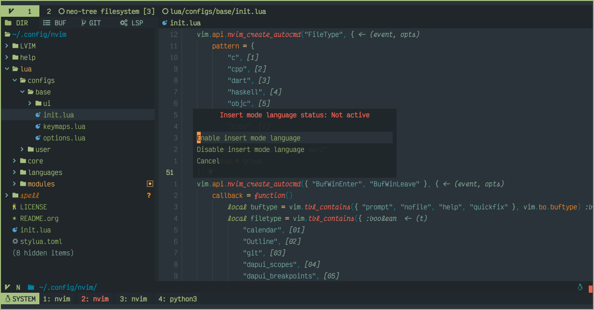
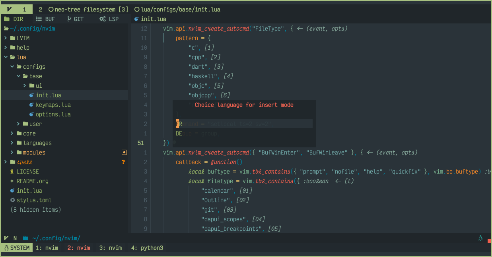
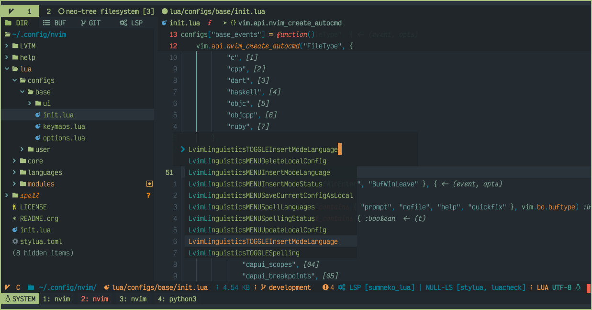
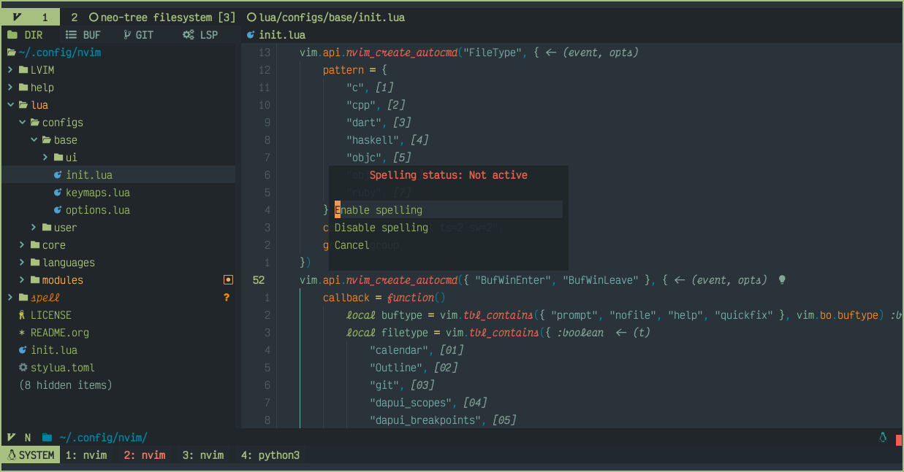
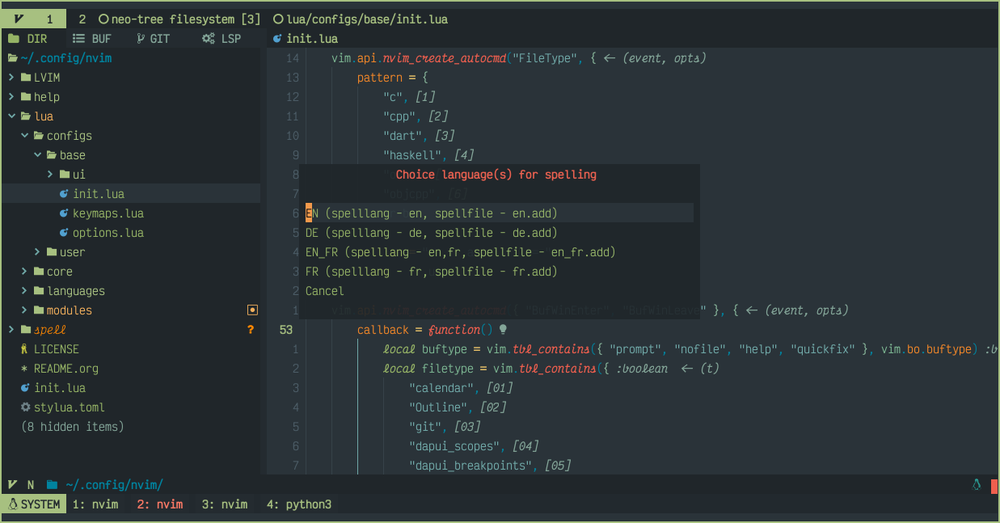
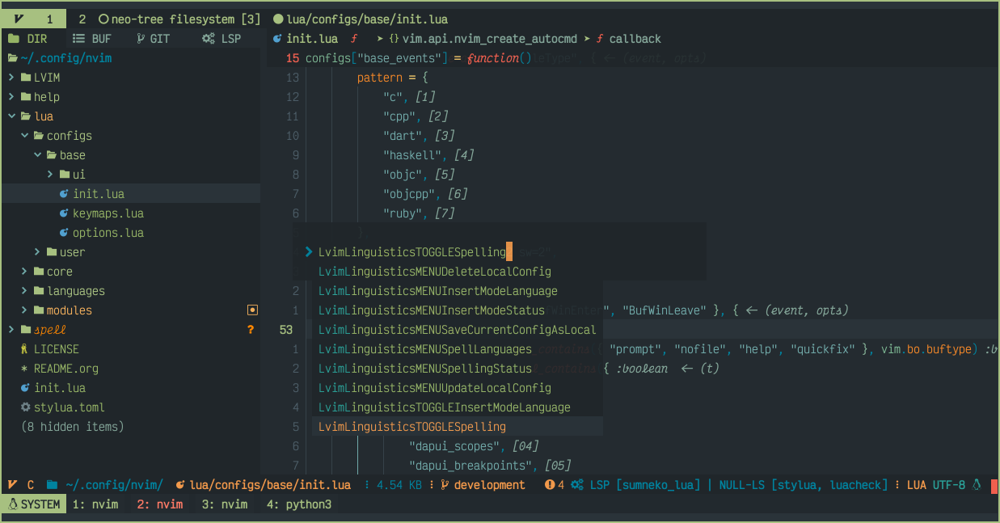
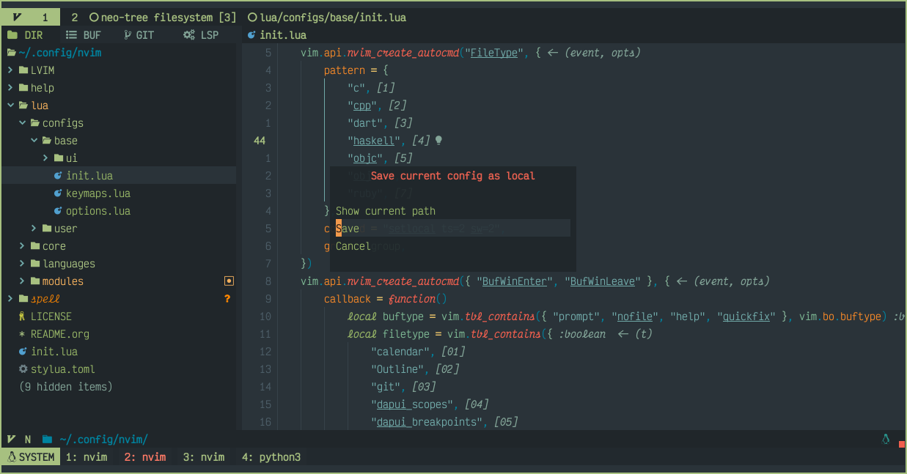
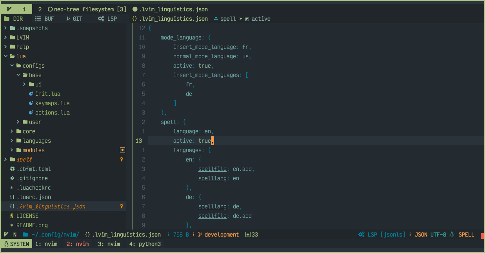
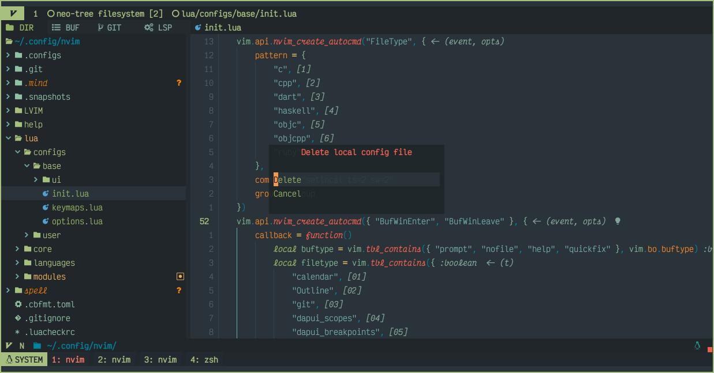

# LVIM LINGUISTICS


[](https://github.com/lvim-tech/lvim-helper/blob/main/LICENSE)

## DESCRIPTION

Lvim Linguistics is a plug-in for controlling spelling and keyboard language in insert mode (when writing a document in
a different language).

> This plug-in is support local config for projects (directories)

> Current version - 1.0.30 (2022-11-10)

## Requirements:

-   [xkb-switch](https://github.com/grwlf/xkb-switch) - to switch the keyboard (you can use another mechanism)
-   [MunifTanjim/nui.nvim](https://github.com/MunifTanjim/nui.nvim)
-   [rcarriga/nvim-notify](https://github.com/rcarriga/nvim-notify)
-   [lvim-tech/lvim-ui-config](https://github.com/lvim-tech/lvim-ui-config)

## Init

```lua
use({
    "lvim-tech/lvim-linguistics",
    event = "VimEnter",
    requires = {
        {
            "MunifTanjim/nui.nvim",
        },
        {
            "rcarriga/nvim-notify",
        },
        {
            "lvim-tech/lvim-ui-config",
        },
    },
    config = function()
        require("lvim-linguistics").setup({
            -- your config
        })
    end,
})
```

## Default config

```lua
plugin_config = {
    kbrd_cmd = "xkb-switch -s ",
    spell_files_folder = os.getenv("HOME") .. "/.config/nvim/spell/",
},
base_config = {
    mode_language = {
        active = false,
        file_types = {
            black_list = {
                "alpha",
                "ctrlspace",
                "ctrlspace_help",
                "packer",
                "undotree",
                "diff",
                "Outline",
                "NvimTree",
                "LvimHelper",
                "floaterm",
                "toggleterm",
                "Trouble",
                "dashboard",
                "vista",
                "spectre_panel",
                "DiffviewFiles",
                "flutterToolsOutline",
                "log",
                "qf",
                "dapui_scopes",
                "dapui_breakpoints",
                "dapui_stacks",
                "dapui_watches",
                "calendar",
                "octo",
                "neo-tree",
                "neo-tree-popup",
                "noice",
            },
            white_list = {},
        },
        normal_mode_language = nil,
        insert_mode_language = nil,
        insert_mode_languages = {},
    },
    spell = {
        active = false,
        file_types = {
            black_list = {
                "alpha",
                "ctrlspace",
                "ctrlspace_help",
                "packer",
                "undotree",
                "diff",
                "Outline",
                "NvimTree",
                "LvimHelper",
                "floaterm",
                "toggleterm",
                "Trouble",
                "dashboard",
                "vista",
                "spectre_panel",
                "DiffviewFiles",
                "flutterToolsOutline",
                "log",
                "qf",
                "dapui_scopes",
                "dapui_breakpoints",
                "dapui_stacks",
                "dapui_watches",
                "calendar",
                "octo",
                "neo-tree",
                "neo-tree-popup",
                "noice",
            },
            white_list = {},
        },
        language = nil,
        languages = {
            en = {
                spelllang = "en",
                spellfile = "en.add",
            },
        },
    },
}
```

-   `kbrd_cmd` - command for switch keyboard

-   `spell_files_folder` - folder to save spell files

-   `base_config` - config for mode language and spelling

-   `base_config` example:

```lua
base_config = {
    mode_language = {
        active = true, -- changing the keyboard language start automatically
        white_list = {
            "tex", -- active is true only for tex filetype
        },
        normal_mode_language = "us", -- keyboard language (normal mode)
        insert_mode_language = "fr", -- keyboard language (insert mode)
        insert_mode_languages = { "fr", "de" }, -- you can choice language for insert mode
    },
    spell = {
        active = true, -- spelling start automatically
        white_list = {
            "tex", -- active is true only for tex filetype
        },
        language = "ft", -- language for spellin
        languages = { -- you can choice language for spelling
            en = {
                spelllang = "en",
                spellfile = "en.add",
            }, -- config for en
            fr = {
                spelllang = "fr",
                spellfile = "fr.add",
            }, -- config for fr
            de = {
                spelllang = "de",
                spellfile = "de.add",
            }, -- config for de
            en_fr = {
                spelllang = "en,fr",
                spellfile = "en_fr.add",
            }, -- config for en + fr
        },
    },
}
```

## Commands

### Mode language

-   `LvimLinguisticsMENUInsertModeStatus`

Enable / Disable changing language in insert mode



-   `LvimLinguisticsMENUInsertModeLanguage`

Language selection for insert mode



-   `LvimLinguisticsTOGGLEInsertModeLanguage`

You can set a keymap for this command to enable/disable

```lua
vim.keymap.set("n", "<C-c>l", function()
    vim.cmd("LvimLinguisticsTOGGLEInsertModeLanguage")
end, { noremap = true, silent = true, desc = "LvimLinguisticsTOGGLEInsertModeLanguage" })
```



### Spell

-   `LvimLinguisticsMENUSpellingStatus`

Enable / Disable spelling



-   `LvimLinguisticsMENUSpellLanguages`

Select spelling language



-   `LvimLinguisticsTOGGLESpelling`

```lua
vim.keymap.set("n", "<C-c>s", function()
    vim.cmd("LvimLinguisticsTOGGLESpelling")
end, { noremap = true, silent = true, desc = "LvimLinguisticsTOGGLESpelling" })
```



### Local config

-   `LvimLinguisticsMENUSaveCurrentConfigAsLocal`

Save the current configuration for the current project (folder)





-   `LvimLinguisticsMENUUpdateLocalConfig`

Update the current configuration for the current project (folder)


-   `LvimLinguisticsMENUDeleteLocalConfig`

Delete a file for the current project (folder)



## Status

You can add custom statusline component for Spell status

-   Example for Heirline:

```lua
local spell = {
    condition = require("lvim-linguistics.status").spell_has,
    provider = function()
        local status = require("lvim-linguistics.status").spell_get()
        return status
    end,
    hl = { fg = "#YOUR_COLOR", bold = true },
}
```
